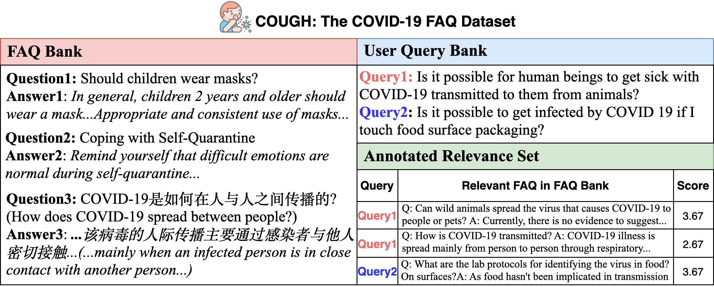

# COUGH: A Challenge Dataset and Models for COVID-19 FAQ Retrieval 

## Introduction
This repository contains the dataset for paper ["COUGH: A Challenge Dataset and Models for COVID-19 FAQ Retrieval"](https://arxiv.org/abs/2010.12800).

In this work, we present a large challenging dataset, **COUGH**, for COVID-19 FAQ retrieval. Specifically, similar to a standard FAQ dataset, **COUGH** consists of three parts: FAQ Bank, User Query Bank and Annotated Relevance Set. FAQ Bank contains ~16K FAQ items scraped from 55 credible websites (e.g., CDC and WHO). For evaluation, we introduce User Query Bank and Annotated Relevance Set, where the former contains 1201 human-paraphrased queries while the latter contains ~32 human-annotated FAQ items for each query.


Statistics and Comparison of **COUGH** with representative counterparts:

|  | FAQIR | StackFAQ | LocalGov | Sun and Sedoc | Poliak et al. | **COUGH** (ours)
| :------: | :------: | :------: | :----: | :------: | :------: | :----: |
|Domain | Yahoo! | StackExachange | Government | COVID-19 | COVID-19 | COVID-19 |
|\# of FAQs | 4313 | 719 | 1786 | 690 | 2115 | 15919 |
|\# of Queries (Q) | 1233 | 1249 | 784 | 6495* | 24240* | 1201 |
|\# of annotations per Q | 8.22 | Not Applicable | <10 | 5 | 5 | 32.17 |
|Query Length | 7.30 | 13.84 | ** | ** | ** | 12.97 |
|FAQ-query Length | 12.30 | 10.39 | ** | ** | ** | 13.00 |
|FAQ-answer Length | 33.00 | 76.54 | ** | ** | ** | 113.58 |
|Language | English | English | Japanese | English | Multi-lingual | Multi-lingual |
|\# of sources | 1 | 1 | 1 | 12 | 34 | 55 |

*: Extracted from existing resources (e.g., COVID-19 Twitter dataset).  
\*\*: Not Applicable, as either not in English or not publicly available.

Examples from **COUGH** dataset are shown below:
<p align="center">

</p>

A list of websites where we collect FAQ items can be found at ```List_of_websites.txt``` (Please consult the appendix in our paper for detailed statistics)

## License
<a rel="license" href="http://creativecommons.org/licenses/by-nc-sa/4.0/"></a><br />This work is licensed under a <a rel="license" href="http://creativecommons.org/licenses/by-nc-sa/4.0/">Creative Commons Attribution-NonCommercial-ShareAlike 4.0 International License</a>.

## Dataset
**COUGH** can be freely accessed and downloaded under ```data``` directory of this repo (Delimiter used in following csv files: comma (,))

- ```data/FAQ_Bank.csv``` is the full FAQ Bank containing a total number of 15919 FAQ items.

- ```data/FAQ_Bank_eval.csv``` is the FAQ Bank specifically used for evaluation purpose, containing a total number of 7117 English non-Forum FAQ items.

- ```data/User_Query_Bank.csv``` is the User Query Bank containing a total number of 1201 user queries. 

- ```data/Annotated_Relevance_Set``` is the Annotated Relevance Set containing a total number of 39760 annotated <User Query, FAQ item> tuples.

*Note that, to replicate results as reported in paper, please use ```data/FAQ_Bank_eval.csv```.*

## Useful Codes
You can refer to this [package](https://pypi.org/project/rank-bm25/) for an easy-to-use BM25 search engine.

You can refer to this [repository](https://github.com/UKPLab/sentence-transformers) for handy SentenceBERT models.

Please counsult our paper at Section 5 (Experiment) for more information about how we set up experiments and deploy baseline models.

## Citation
Please kindly cite our paper if you use the **COUGH** dataset from this repo:
```
@article{zhang2020cough,
      title={COUGH: A Challenge Dataset and Models for COVID-19 FAQ Retrieval}, 
      author={Xinliang (Frederick) Zhang and Heming Sun and Xiang Yue and Emmett Jesrani and Simon Lin and Huan Sun},
      journal={arXiv preprint arXiv:2010.12800},
      year={2020}
}  
```

## Disclaimer
This dataset can be used for research and education purpose only. It is shared under the CC BY-NC-SA 4.0 license. 

For dataset user: If you want to use the dataset for other purposes, please check the terms of use for each individual source.

For owners of websites from which **COUGH** data are collected: If you don't want to share content with us, please contact us at Xinliang (Frederick) Zhang <zhang.9975 AT osu DOT edu> or Huan Sun <sun.397 AT osu DOT edu>, and we can remove the respective information.

The views, information, or opinions expressed in **COUGH** dataset are solely those of the websites from which FAQ items were scrapped and do not necessarily represent those of the authors of this paper. The primary purpose of releasing **COUGH** is to aid the development of COVID-19 FAQ retrieval systems.
